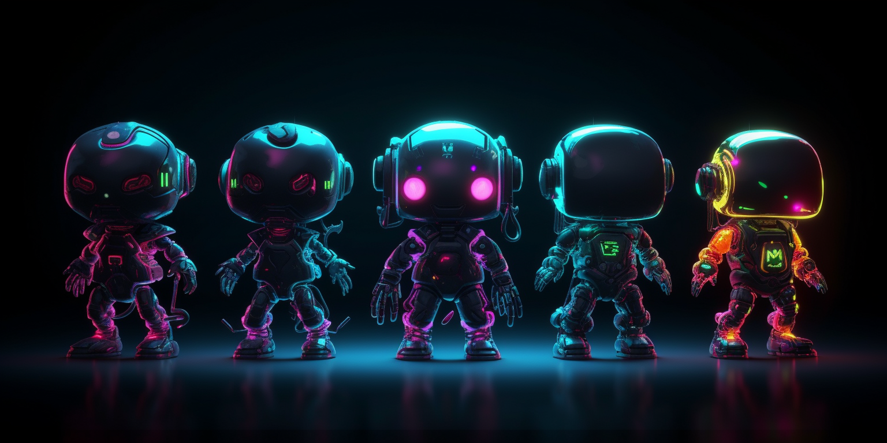

# Brain Fusion Labs

Brain Fusion Labs is an AI consulting and software development company committed to empowering businesses with bespoke AI solutions and expert guidance. We are passionate about helping our clients harness the power of artificial intelligence to enhance operational efficiency, drive innovation, and secure a competitive advantage in their respective industries.

## Table of Contents
- [Our Services](#our-services)
- [Our Approach](#our-approach)
- [Success Stories](#success-stories)
- [Technologies and Tools](#technologies-and-tools)
- [Our Team](#our-team)
- [News and Updates](#news-and-updates)
- [FAQs](#faqs)

## Our Services

At Brain Fusion Labs, we deliver cutting-edge AI solutions that transform the way businesses operate. Our services include:

- **AI Consulting:** We work closely with clients to understand their business objectives and challenges, and provide expert guidance on how AI can help achieve their goals.

- **Custom AI Software Development:** We develop customized AI software solutions that address clients' unique challenges and requirements.

- **Machine Learning and Data Science Services:** Our team of experts develops and deploys machine learning models that help businesses gain insights from their data and make informed decisions.

- **AI Training and Workshops:** We offer training and workshops on AI technologies and their applications, to help businesses and individuals stay ahead of the curve.

- **Ongoing AI Support and Maintenance:** We provide ongoing support and maintenance for our clients' AI solutions, ensuring that they continue to operate efficiently and effectively.

## Our Approach

Our team of experts is dedicated to working closely with clients to identify their unique challenges and design customized solutions that address their specific needs. We believe that AI has the power to revolutionize industries and drive significant growth and innovation. Our approach is based on the following principles:

- **Customer-centric approach:** We put our clients at the center of everything we do, and strive to understand their business objectives and challenges.

- **Cutting-edge technologies:** We use the latest and most advanced AI technologies and tools to develop our solutions.

- **Collaborative approach:** We work collaboratively with our clients, leveraging their domain expertise to develop solutions that meet their specific needs.

- **Focus on outcomes:** We focus on delivering measurable outcomes for our clients, such as improved operational efficiency, cost savings, and revenue growth.

## Success Stories

Coming soon.

## Technologies and Tools

At Brain Fusion Labs, we use advanced technologies and tools to develop our AI solutions. Our expertise includes:

### Natural Language Processing (NLP)

We utilize a variety of NLP tools to help our clients extract insights from textual data. Our team has experience developing solutions for text classification, sentiment analysis, and information extraction.

### Computer Vision

We have extensive experience in Computer Vision, using popular frameworks to develop solutions for object detection, image recognition, and face recognition, among others.

### Deep Learning

Our team has a deep understanding of deep learning technologies, including convolutional neural networks (CNNs), recurrent neural networks (RNNs), and generative adversarial networks (GANs). We have developed solutions for various use cases such as image and speech recognition, natural language processing, and anomaly detection.

### Reinforcement Learning

We are exploring the use of Reinforcement Learning for developing autonomous systems that can learn from their environment and adapt their behavior accordingly.

## Our Team

Brain Fusion Labs was founded by Daniel Banta and TAYLOR.WTF, two accomplished professionals with extensive experience in AI, machine learning, software development, and engineering. Our team consists of highly skilled and experienced professionals who are passionate about AI and dedicated to delivering exceptional results for our clients.

## News and Updates

Stay up to date on Brain Fusion Labs' latest news and developments. Follow us on social media or visit our website for the latest updates on new partnerships, product releases, or events.

## FAQs

**Q: What kind of businesses do you work with?**

A: We work with businesses of all sizes across a range of industries, including healthcare, finance, retail, and manufacturing. Our expertise in AI and machine learning allows us to develop customized solutions for each client's unique needs.

**Q: How much do your services cost?**

A: The cost of our services varies depending on the scope and complexity of the project. We work with each client to develop a customized solution that meets their needs and budget. Please contact us to discuss your project and get a customized quote.

**Q: What kind of AI solutions do you offer?**

A: We offer a range of AI solutions, including consulting, custom software development, machine learning and data science services, AI training and workshops, and ongoing support and maintenance. We work with clients to identify their unique challenges and develop customized solutions that meet their specific needs.

**Q: How long does it take to develop an AI solution?**

A: The timeline for developing an AI solution varies depending on the scope and complexity of the project. We work with clients to establish a timeline and milestones for each project, and provide regular updates on progress.

**Q: Do you offer ongoing support and maintenance for your AI solutions?**

A: Yes, we provide ongoing support and maintenance for all of our AI solutions to ensure that they continue to operate efficiently and effectively. We offer a range of support and maintenance options to meet each client's specific needs.

**Q: What sets Brain Fusion Labs apart from other AI consulting companies?**

A: We are committed to delivering cutting-edge AI solutions that meet our clients' unique needs and exceed their expectations. Our team of experts has extensive experience in AI, machine learning, software development, and engineering, and is dedicated to providing exceptional service and results. We work collaboratively with clients to understand their business objectives and challenges, and develop customized solutions that drive growth and innovation.

---

At Brain Fusion Labs, we are committed to delivering cutting-edge AI solutions that transform the way businesses operate. Contact us today to learn how we can help your business harness the power of AI.
